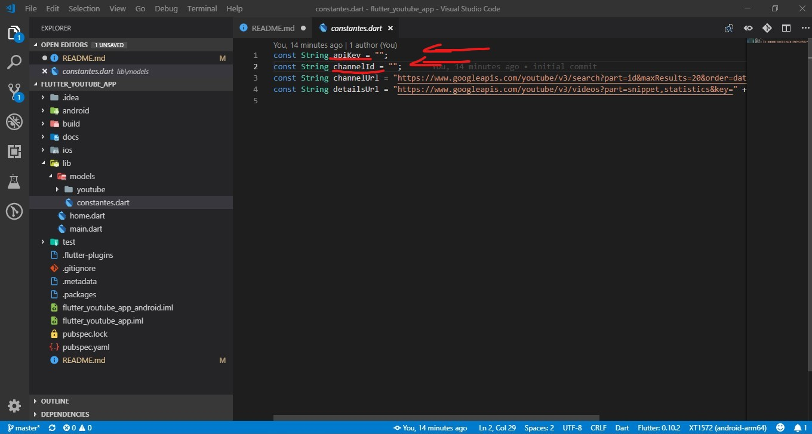
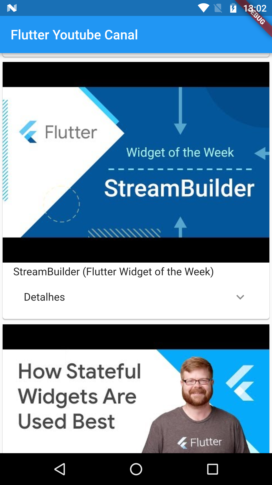

# flutter_youtube_app

Um exemplo de aplicação flutter que consome a API V3 do Youtube lstando os videos do canal.

## Getting Started

Para obter ajuda para começar a usar o Flutter, consulte o gia on-line  
[documentação](https://flutter.io/).

para gerar o Key de acesso ao canal do youtube, consulte o link abaixo:  
[Key Youtube](https://developers.google.com/youtube/registering_an_application?hl=pt-br).

Altere a key no arquivo "flutter_youtube_app\lib\models\constantes.dart"

## Resultado

